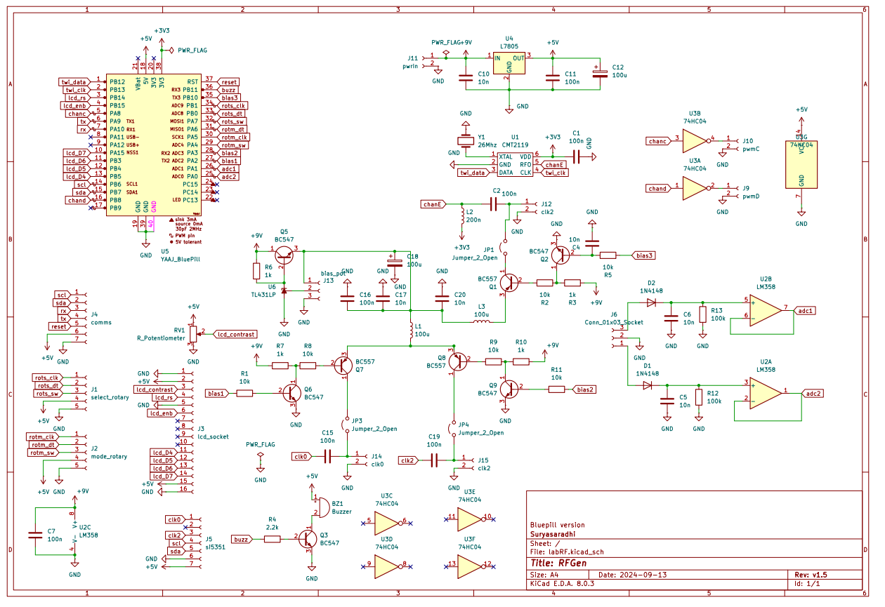

# RFGen

This is an open source DIY Square wave generator. There are two versions included: 
- Blue pill - (1Hz - 960Mhz)
- Atmega328p/Arduino (1Hz - 250Mhz)

### Schematics:

Arduino version

Bluepill version

- Si5351 - Channel A,B (1Khz - 250Mhz)
- CMT2119A - Channel E (only for bluepill version: 250Mhz - 960Mhz)

# Installation

- Upload 328p schematics for an Arduino based generator.
- Upload bluepill schematic for Bluepilll based generator.

> Gerber files attatched with kicad designs

# Usage

There is a bias tee included for these channels whose bias can be adjusted by the attached external potentiometer. 

Supply 9V on the power input, this is regulated to 5v by l7805

# Development

To program a soldered bluepill via USB kindly power off the device before connecting the USB. SInce UART pins are exposed you can program it via those headers too.

# Contribute

You can use this section to highlight how people can contribute to your project.

You can add information on how they can open issues or how they can sponsor the project.

